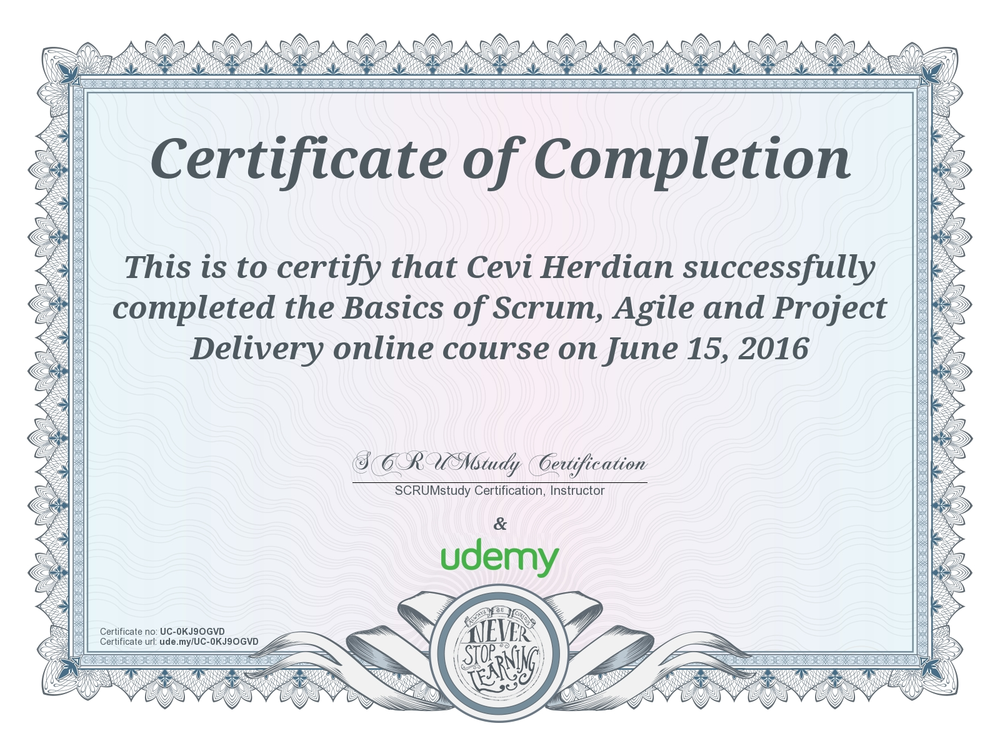

# Agile Scrum project management

[What is Scrum and Agile?](https://www.cprime.com/resources/what-is-agile-what-is-scrum/)

Scrum Fundamental Certified

[https://www.scrumstudy.com/](https://www.scrumstudy.com/)

Trello Project Management

[https://www.udemy.com/certificate/UC-MXUN2SSV/](https://www.udemy.com/certificate/UC-MXUN2SSV/)

Basics of Scrum, Agile and Project Delivery

[https://www.udemy.com/certificate/UC-0KJ9OGVD/](https://www.udemy.com/certificate/UC-0KJ9OGVD/)

