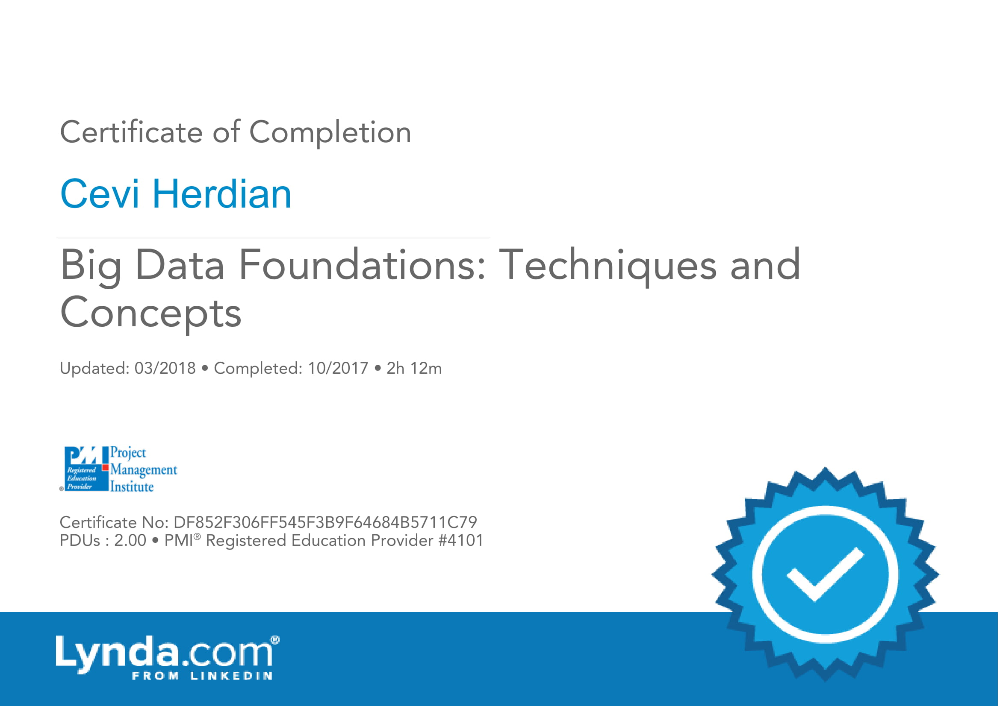
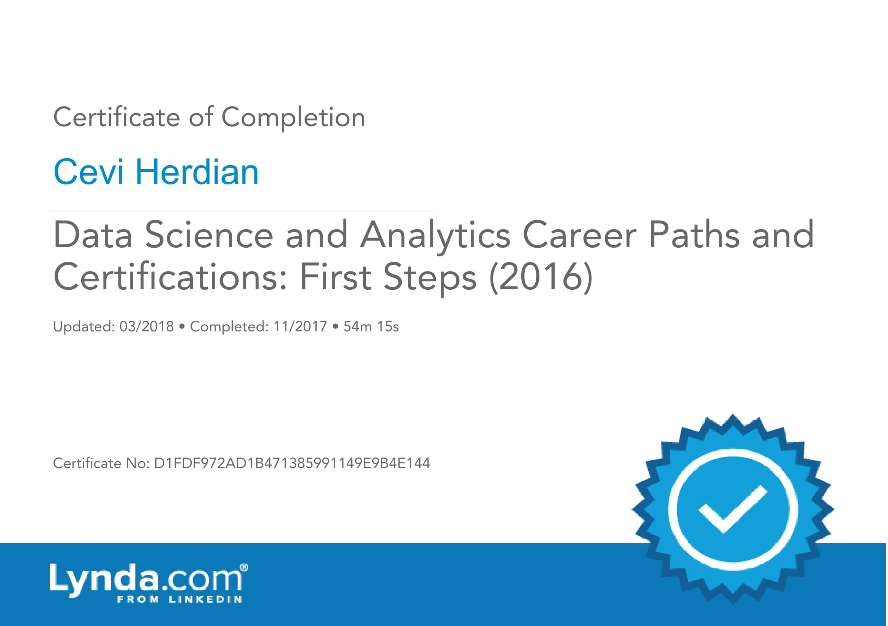

# BIG data & Data Science

Big Data Foundations: Techniques and Concepts

[https://www.lynda.com/home/CertificateOfCompletion/PrintCertificate.aspx?lpk57=DF852F306FF545F3B9F64684B5711C79](https://www.lynda.com/home/CertificateOfCompletion/PrintCertificate.aspx?lpk57=DF852F306FF545F3B9F64684B5711C79)

Data Science and Analytics Career Paths and Certifications: First Steps

[https://www.lynda.com/home/CertificateOfCompletion/PrintCertificate.aspx?lpk57=D1FDF972AD1B471385991149E9B4E144](https://www.lynda.com/home/CertificateOfCompletion/PrintCertificate.aspx?lpk57=D1FDF972AD1B471385991149E9B4E144)

