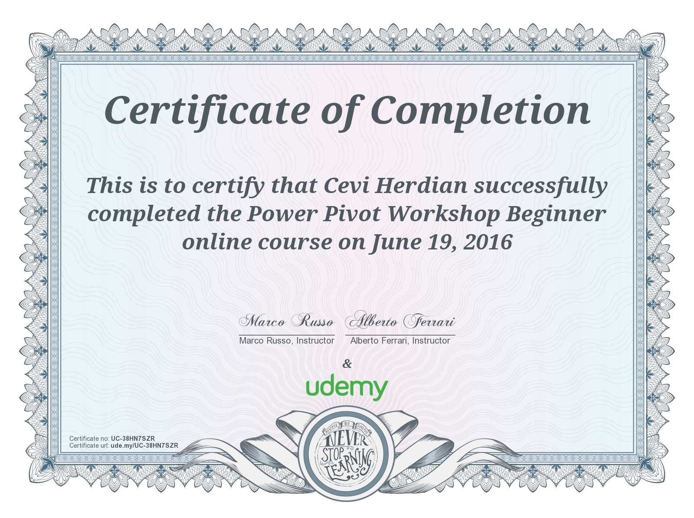

# DAX & Power Pivot

[What is DAX?](https://support.office.com/en-us/article/quickstart-learn-dax-basics-in-30-minutes-51744643-c2a5-436a-bdf6-c895762bec1a)

[What is Power Pivot?](https://support.office.com/en-us/article/power-pivot-powerful-data-analysis-and-data-modeling-in-excel-a9c2c6e2-cc49-4976-a7d7-40896795d045)

### Power Pivot Workshop Beginner

[https://www.udemy.com/certificate/UC-38HN7SZR/](https://www.udemy.com/certificate/UC-38HN7SZR/)

