# MS-Excel, udemy.com

**Excel 2016:** 

[https://www.udemy.com/certificate/UC-289P22FT/](https://www.udemy.com/certificate/UC-289P22FT/)

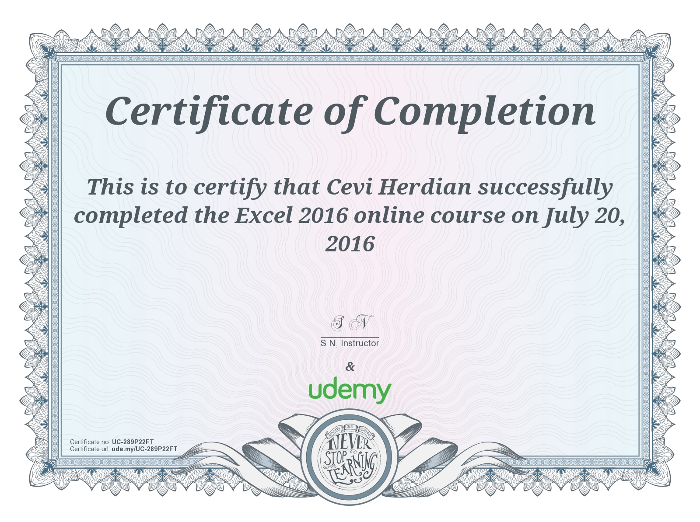

**Excel 2016 Pivot Tables: Create Basic Pivot Tables in Excel**

[https://www.udemy.com/certificate/UC-X5MUL1CQ/](https://www.udemy.com/certificate/UC-X5MUL1CQ/)

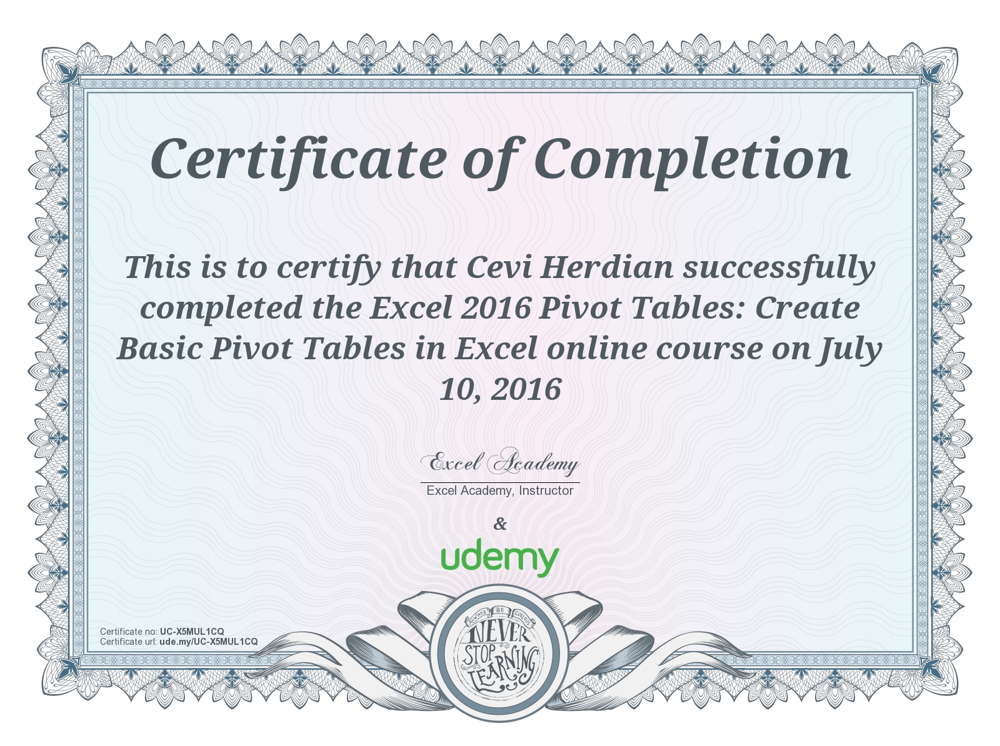

**Excel 2016, The Key Ingredients**

[https://www.udemy.com/certificate/UC-Z5SXMHSS/](https://www.udemy.com/certificate/UC-Z5SXMHSS/)

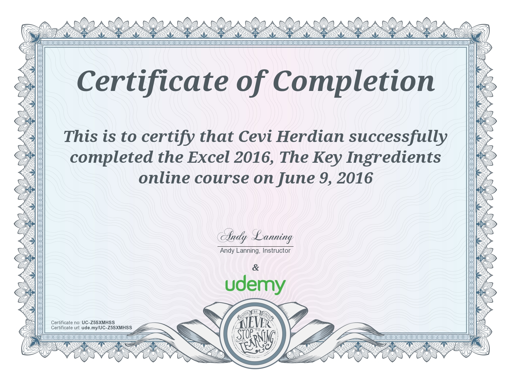

**Excel Afterburner Fundamentals**

[https://www.udemy.com/certificate/UC-B6XDT1NO/](https://www.udemy.com/certificate/UC-B6XDT1NO/)

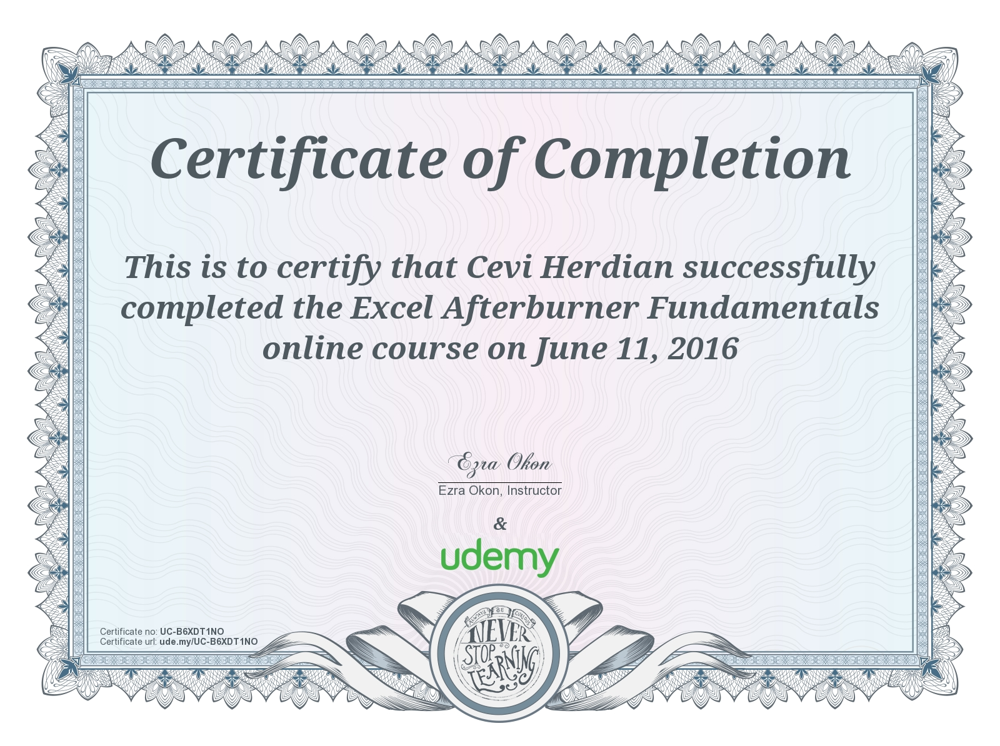

**Excel Formulas and Functions with Excel Formulas Cheat Sheet**

[https://www.udemy.com/certificate/UC-PKRP4PEH/](https://www.udemy.com/certificate/UC-PKRP4PEH/)

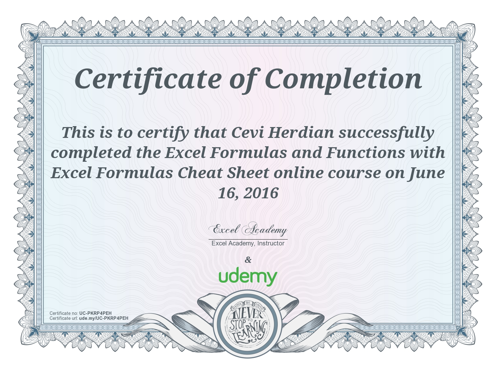

**Excel with Top Microsoft Excel Hacks**

[https://www.udemy.com/certificate/UC-7MYI12FK/](https://www.udemy.com/certificate/UC-7MYI12FK/)

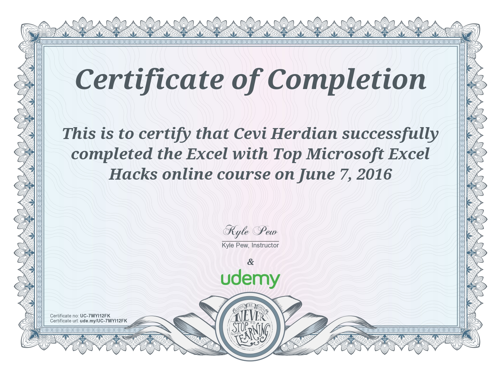

**Excel Charts - Online Training**

[https://www.udemy.com/certificate/UC-PGF80LU7/](https://www.udemy.com/certificate/UC-PGF80LU7/)

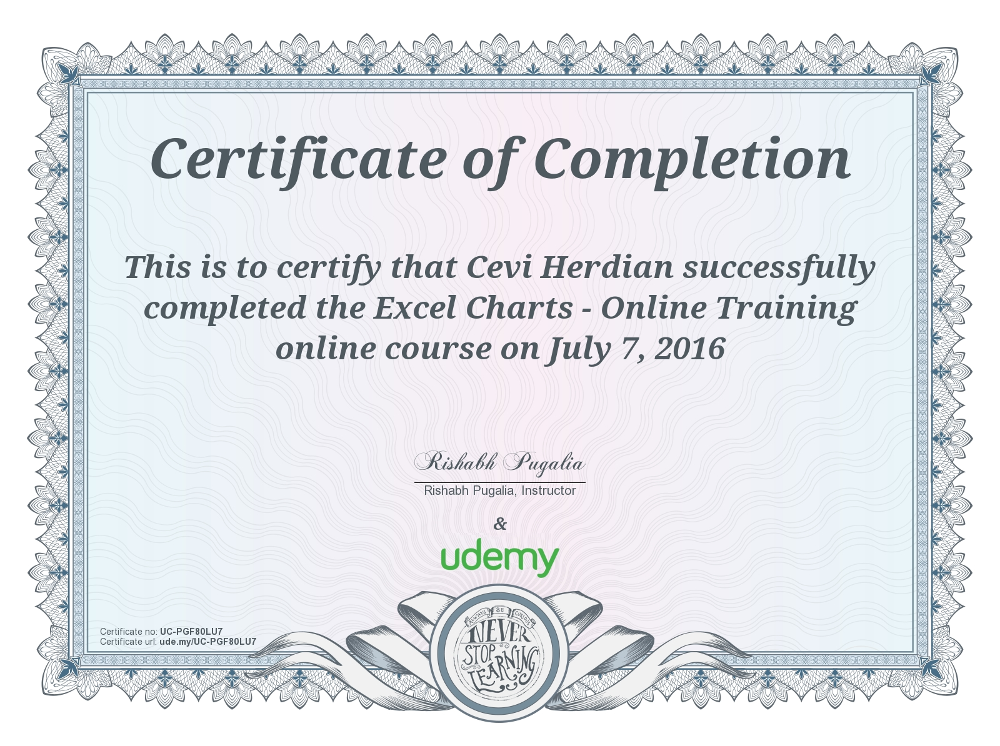

**How to use Vlookup in Excel**

[https://www.udemy.com/certificate/UC-QWU31AXI/](https://www.udemy.com/certificate/UC-QWU31AXI/)

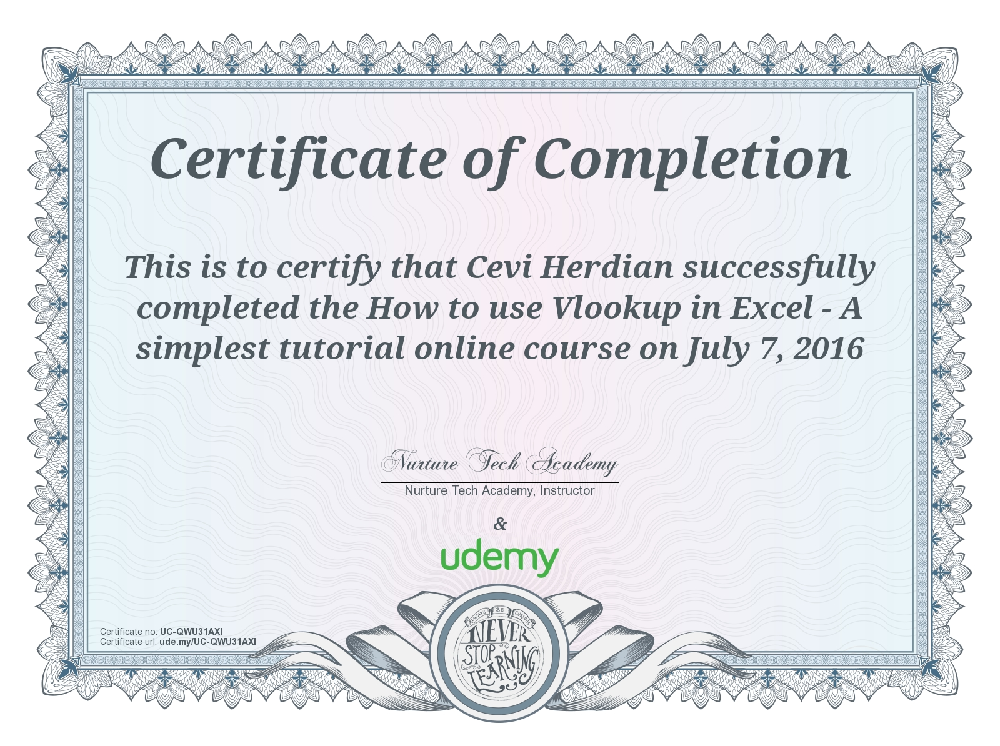

**Intermediate Excel: Crash Course**

[https://www.udemy.com/certificate/UC-FF9KY40T/](https://www.udemy.com/certificate/UC-FF9KY40T/)

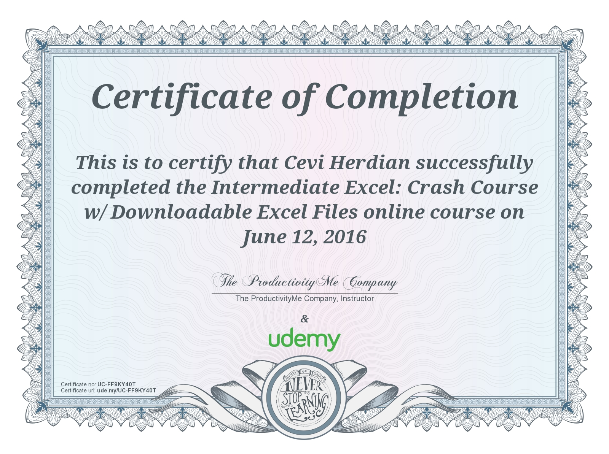

**Master Microsoft Excel Table Design**

[https://www.udemy.com/certificate/UC-K6GR9JHW/](https://www.udemy.com/certificate/UC-K6GR9JHW/)

**MS Excel - From 0 to Working Professional in 1 hour**

[https://www.udemy.com/certificate/UC-904BMI7E/](https://www.udemy.com/certificate/UC-904BMI7E/)

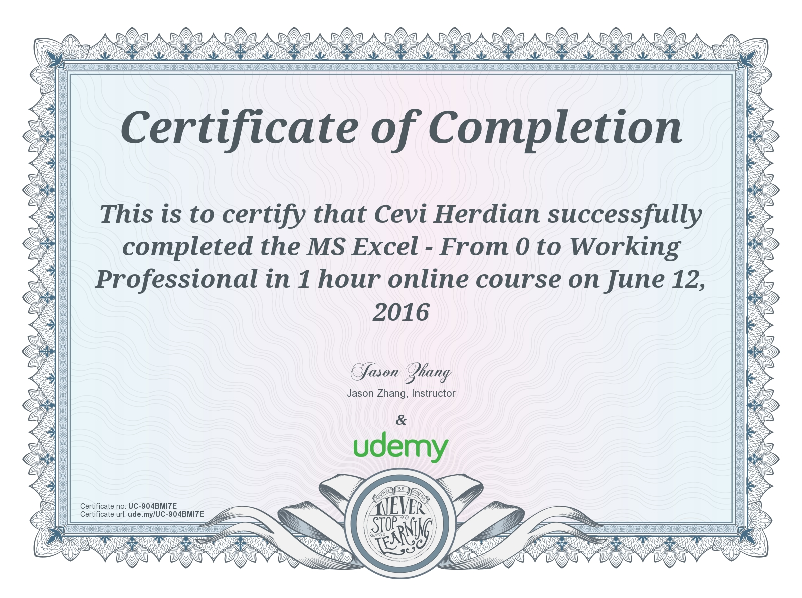

**Top 10 Excel Skills For Successful Business Professionals**

[https://www.udemy.com/certificate/UC-VSENN2W7/](https://www.udemy.com/certificate/UC-VSENN2W7/)

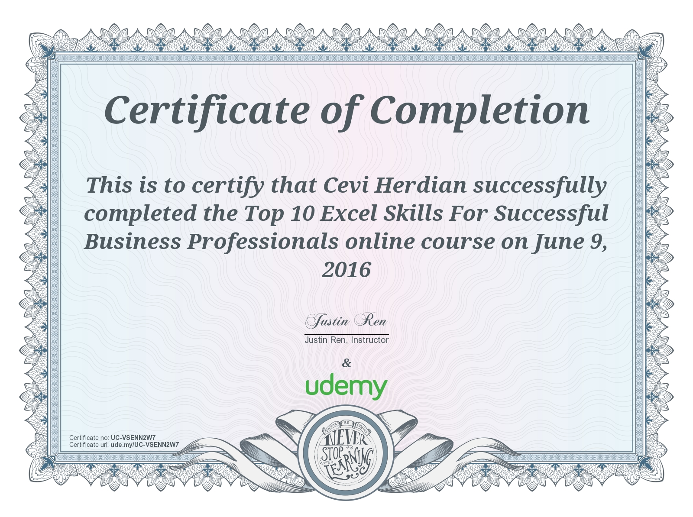

**Useful Tools of Excel at Intermediate Level**

[https://www.udemy.com/certificate/UC-1WFZK0BD/](https://www.udemy.com/certificate/UC-1WFZK0BD/)

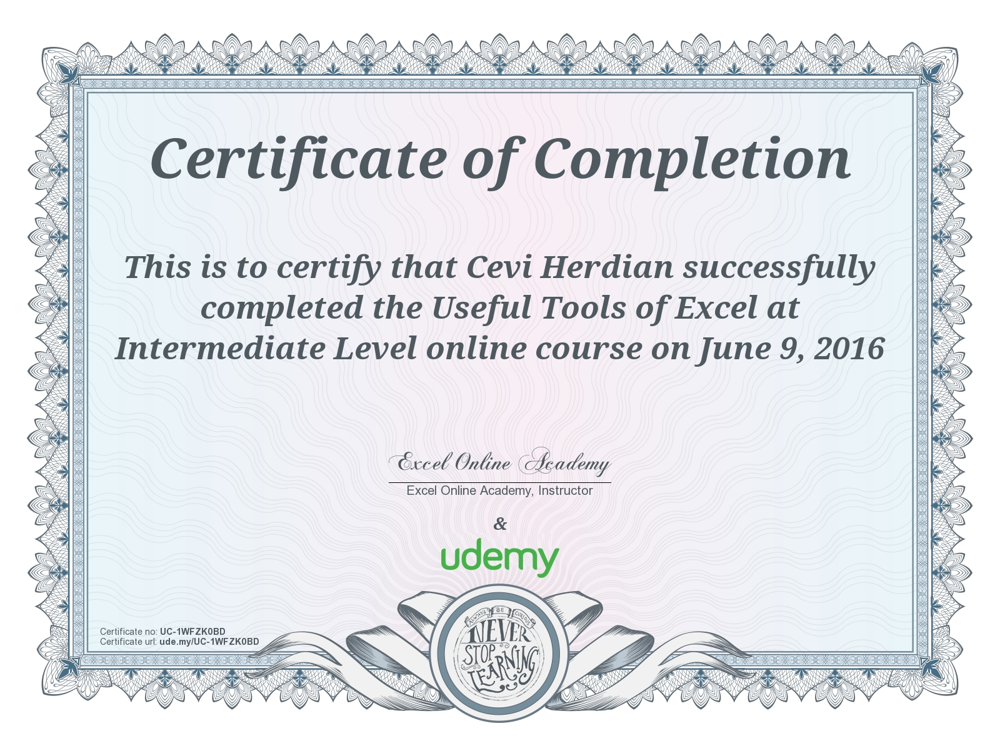

