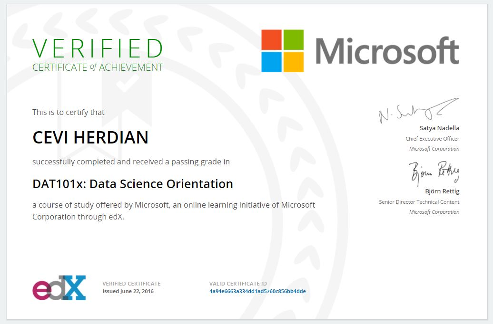
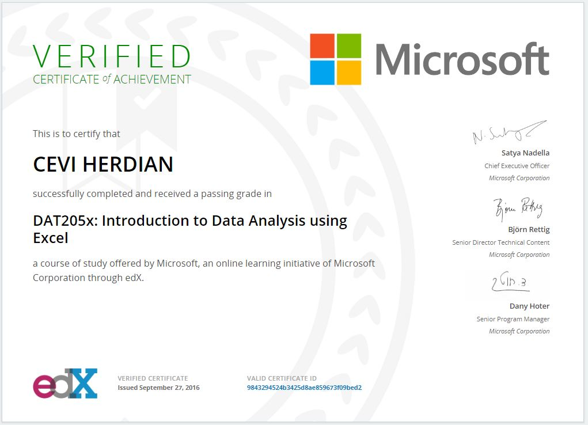
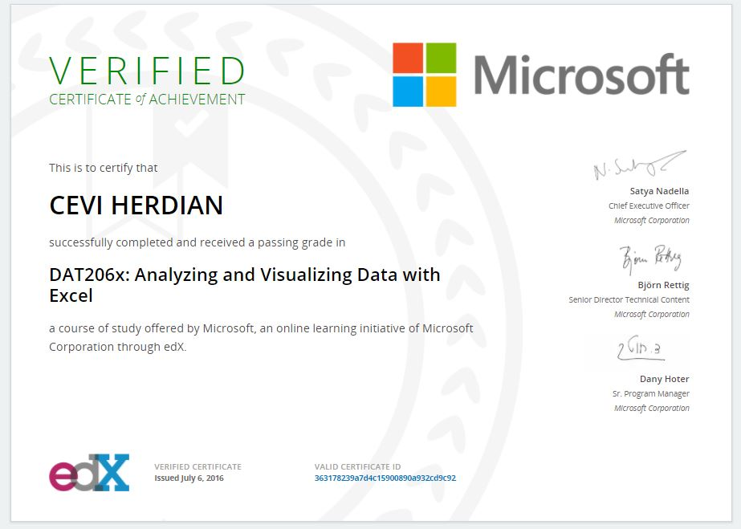

# Microsoft Professional Program for Data Science

 [https://academy.microsoft.com/en-us/professional-program/](https://academy.microsoft.com/en-us/professional-program/)

## **Data Science Orientation:**

 [https://courses.edx.org/certificates/4a94e6663a334dd1ad5760c856bb4dde](https://courses.edx.org/certificates/4a94e6663a334dd1ad5760c856bb4dde)

## Introduction to Data Analysis using Excel:

 [https://courses.edx.org/certificates/9843294524b3425d8ae859673f09bed2](https://courses.edx.org/certificates/9843294524b3425d8ae859673f09bed2)

## Analyzing and Visualizing Data with Excel:

 [https://courses.edx.org/certificates/363178239a7d4c15900890a932cd9c92](https://courses.edx.org/certificates/363178239a7d4c15900890a932cd9c92)

