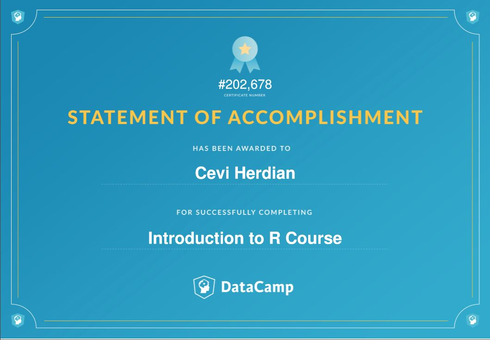
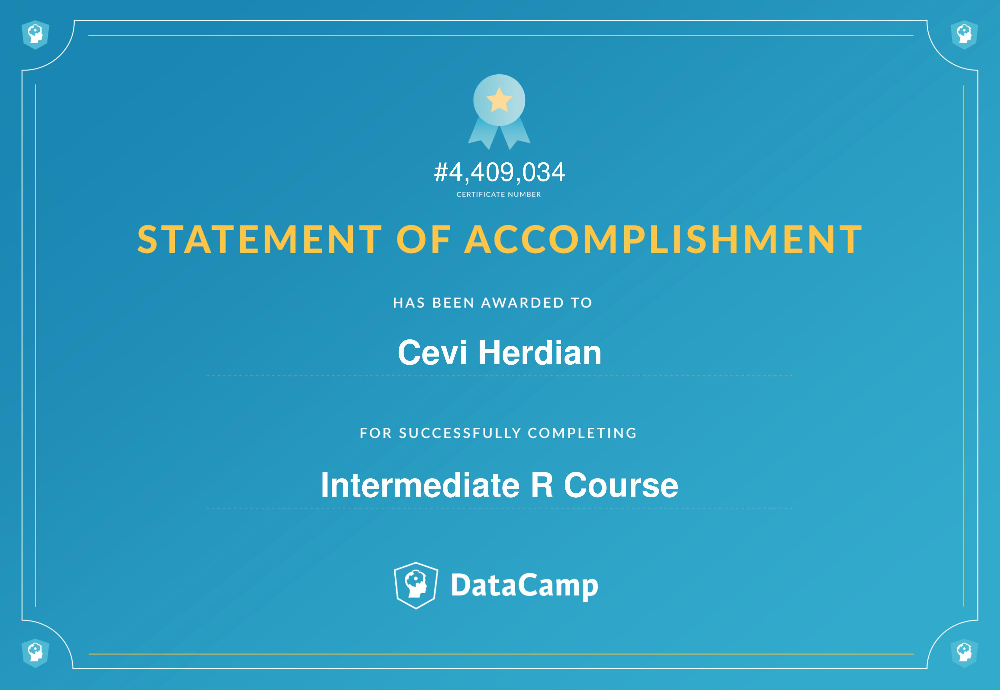
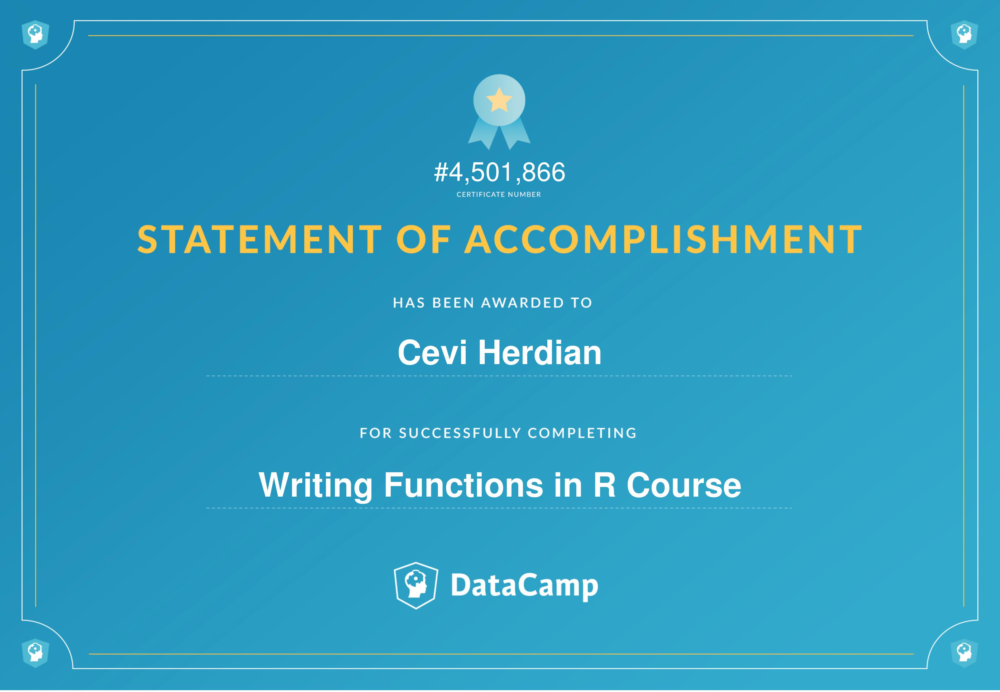

# R programming track, datacamp.com

\#1-Datacamp: Introduction to R

[https://www.datacamp.com/statement-of-accomplishment/course/51a755e29b3e892541eff76e37d498379e8c256a](https://www.datacamp.com/statement-of-accomplishment/course/51a755e29b3e892541eff76e37d498379e8c256a)

\#2-Intermediate R

[https://www.datacamp.com/statement-of-accomplishment/course/425287e7b1fc5e1aa6684528d0e66c4748a7fb44](https://www.datacamp.com/statement-of-accomplishment/course/425287e7b1fc5e1aa6684528d0e66c4748a7fb44)

\#3-Writing Functions in R

[https://www.datacamp.com/statement-of-accomplishment/course/755ff586db02cfd92811ccd5b6ffa7d438eaa43c](https://www.datacamp.com/statement-of-accomplishment/course/755ff586db02cfd92811ccd5b6ffa7d438eaa43c)

