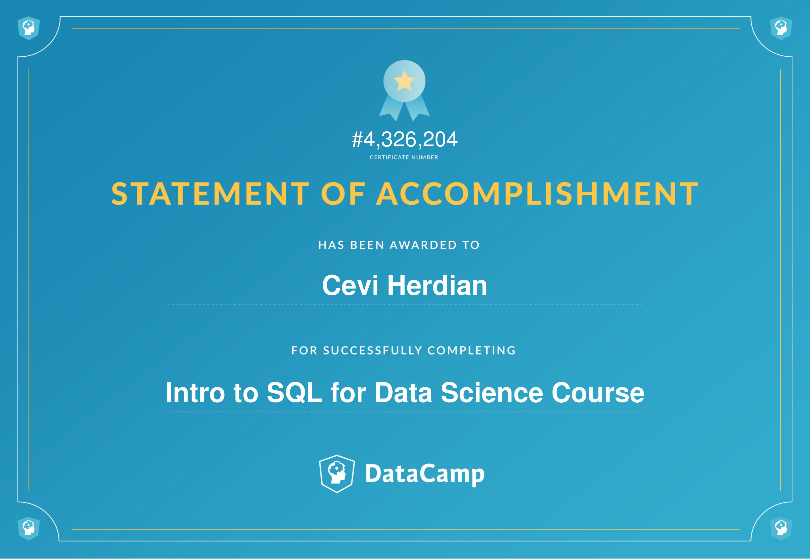
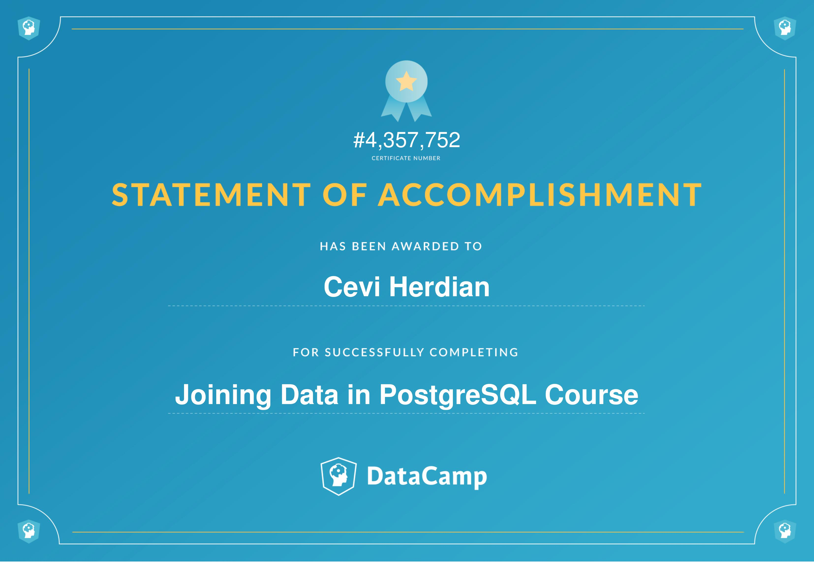
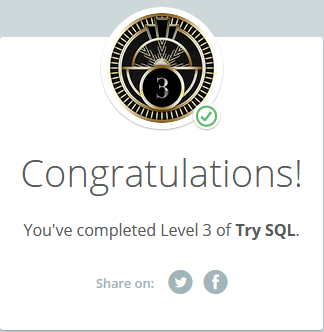

# SQL-structured query languages

### Intro to SQL for Data Science

[https://www.datacamp.com/statement-of-accomplishment/course/aeb664bb193134e8ad67e7182a8b95e12a4ae85c](https://www.datacamp.com/statement-of-accomplishment/course/aeb664bb193134e8ad67e7182a8b95e12a4ae85c)

### Joining data in PostgreSQL

[https://www.datacamp.com/statement-of-accomplishment/course/d244f8cca1aa8c89345533c45b2ca66ad986d090](https://www.datacamp.com/statement-of-accomplishment/course/d244f8cca1aa8c89345533c45b2ca66ad986d090
)

### Codeschool Try SQL

[https://www.codeschool.com/users/cevau](https://www.codeschool.com/users/cevau)

